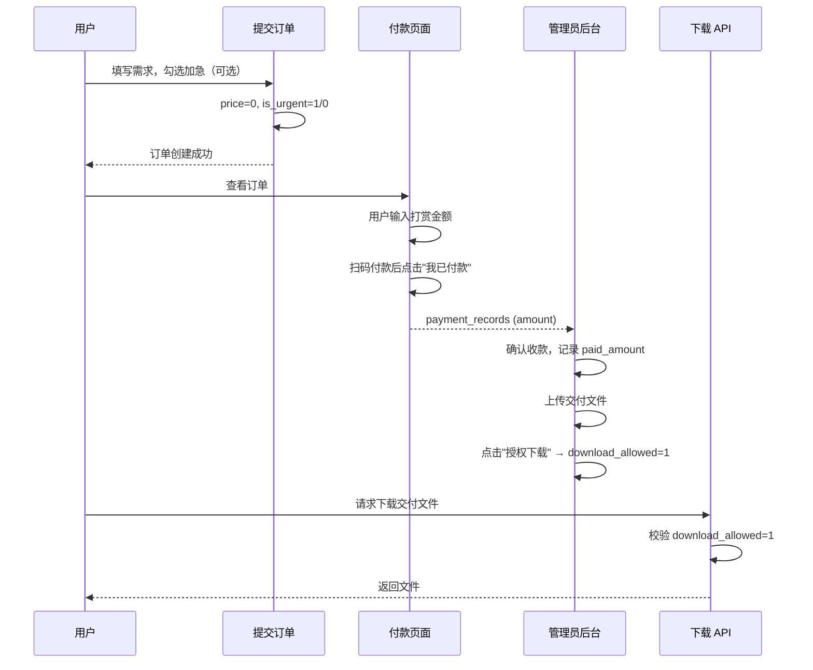

# 打赏制与管理员授权下载 — 设计文档

## 概述

对作业完成助手进行两项核心调整：
1. 取消固定价格（¥15 / ¥25），改为用户自愿打赏
2. 取消自动交付逻辑，改为管理员手动授权用户下载文件

## 1. 数据库变更

### 1.1 orders 表新增字段

```sql
ALTER TABLE orders ADD COLUMN download_allowed INTEGER DEFAULT 0;
```

- `download_allowed = 0`：用户不能下载交付文件
- `download_allowed = 1`：管理员已授权，用户可以下载
- 已有订单默认 `download_allowed = 0`，管理员可在后台手动开启

### 1.2 移除 settings 表配置

不再写入和读取以下配置项：
- `default_price`（原 15 元）
- `urgent_price`（原 25 元）

已有数据不清除，但代码不再引用。

### 1.3 price 字段用法变更

- 新建订单时 `price = 0`（不再固定定价）
- 保留 `price` 字段用于记录用户的实际打赏金额（可选历史记录用途）
- `paid_amount` 仍用于累计已付金额

## 2. 提交订单流程变更

### 2.1 提交页面 (src/app/submit/page.tsx)

- **删除**：价格展示块（原 lines 202-211 的 ¥{price} 显示区域）
- **删除**：`const price = isUrgent ? 25 : 15` 价格计算
- **修改**：加急文案从"加收 10 元"改为"优先处理"
- 提交时不涉及任何金额输入

### 2.2 订单创建 API (src/app/api/orders/route.ts)

- `price` 字段始终设为 0
- 保留 `is_urgent` 标记（仅作为优先级标识）

## 3. 付款流程变更

### 3.1 订单详情页付款区块 (src/app/order/[id]/OrderDetailClient.tsx)

- 固定价格显示 → **打赏金额输入框**，用户自行输入想付的金额
- 扫码付款说明 → "请扫描二维码打赏，输入你想支持的金额"
- "我已付款"按钮将用户输入的金额提交到后端
- 加急订单显示提示："加急订单，建议适当增加打赏金额"

### 3.2 付款确认 API (src/app/api/payment/confirm/route.ts)

- 接受 `amount` 参数（用户填的打赏金额）
- 不再使用 `order.price` 作为付款金额
- 记录用户输入的金额到 `payment_records`

### 3.3 订单列表页 (src/app/orders/page.tsx)

- 价格列显示：已付金额 `¥{paid_amount || 0}`

## 4. 下载授权变更

### 4.1 下载 API 权限校验 (src/app/api/download/[fileId]/route.ts)

- **原逻辑**：交付文件需要 `paid_amount >= price` 才能下载
- **新逻辑**：交付文件需要 `download_allowed = 1` 才能下载
- 管理员始终可下载（保留现有逻辑）

### 4.2 订单详情页下载按钮 (src/app/order/[id]/OrderDetailClient.tsx)

- `download_allowed = 1`：正常显示下载按钮
- `download_allowed = 0`：显示"等待管理员授权"提示，下载按钮置灰或隐藏

### 4.3 移除自动交付逻辑

- 不再通过付款状态自动解锁下载
- `delivered_at` 不再自动设置（但保留字段）

## 5. 管理后台变更

### 5.1 管理员页面 (src/app/admin/AdminClient.tsx)

- **增加"授权下载"开关**：订单详情面板中增加按钮，点击切换 `download_allowed`
  - 显示当前状态：已授权 / 未授权
- **更新收款管理**：
  - 移除"总价"概念
  - 显示已收金额 `¥{paid_amount || 0}`
  - 输入框记录本次收款金额
  - 移除"待收"计算和"收款完成后自动解锁下载"文案
- **订单列表**：金额列改为 `¥{paid_amount || 0}`
- 移除 `delivered` 状态自动设置 `delivered_at` 的逻辑

### 5.2 管理后台 API (src/app/api/admin/orders/route.ts)

- 新增接受 `downloadAllowed` 参数，更新 `download_allowed` 字段
- 移除自动标记 `paid` 状态的逻辑（不再比较 `paid_amount >= price`）

## 6. 涉及文件的完整清单

| 文件 | 改动类型 |
|------|----------|
| `src/lib/db.ts` | 移除 default_price/urgent_price 配置写入；新增 download_allowed 列迁移 |
| `src/app/submit/page.tsx` | 删除价格展示；修改加急文案 |
| `src/app/api/orders/route.ts` | price 设为 0 |
| `src/app/api/orders/[id]/route.ts` | 无变化（仅查询） |
| `src/app/api/payment/confirm/route.ts` | 接受 amount 参数 |
| `src/app/api/download/[fileId]/route.ts` | 改用 download_allowed 校验 |
| `src/app/api/admin/orders/route.ts` | 新增 downloadAllowed 处理；移除 auto-paid 逻辑 |
| `src/app/order/[id]/OrderDetailClient.tsx` | 付款区块改为打赏输入；下载按钮条件显示 |
| `src/app/orders/page.tsx` | 金额列显示 paid_amount |
| `src/app/admin/AdminClient.tsx` | 新增授权下载开关；更新收款管理显示 |

## 7. 数据流


